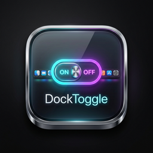

<p align="center">
  
  
  
  
  <br>
  <a href="README.md"></a>
</p>

<p align="center">
  
</p>

# TapHide

把你的 Dock 变成开关：点击运行中 App 的图标来聚焦，再点一次**隐藏**或**最小化**。

<p align="center">
  <i>"点一下聚焦，点两下收起。"</i>
</p>

---

## 原理

```
         ┌────────────────────────────────────┐
         │  CGEvent 事件拦截 (系统级 Hook)     │
         │         鼠标按下事件                │
         └──────────────┬─────────────────────┘
                        │
                        ▼
              ┌─────────────────┐
              │ 在 Dock 区域内？  │─── 否 ──▶ 放行
              └────────┬────────┘
                       │ 是
                       ▼
              ┌─────────────────┐
              │  目标 PID =      │─── 否 ──▶ 放行
              │  前台 PID ？      │
              └────────┬────────┘
                       │ 是
                       ▼
              ┌─────────────────┐
              │  吞掉点击事件    │
              │  执行 隐藏/最小化 │
              └─────────────────┘
```

TapHide 安装一个 `CGEvent` 拦截器捕获鼠标左键。当你点击 Dock 中已在前台的 App 图标时，点击事件被吞掉，转而执行你选择的操作（隐藏或最小化）。

TapHide 的定位是轻量增强原生 Dock，更接近 HyperDock 这类快捷动作增强工具，而不是 uBar 这类完整 Dock/taskbar 替代品。它保留 Apple Dock，只改变“再次点击当前前台 App 图标”的行为。

### 两种模式

| 模式 | 效果 |
|---|---|
| **隐藏** | 隐藏整个 App（相当于 `Cmd+H`） |
| **最小化** | 最小化最前面的窗口（相当于 `Cmd+M`） |

---

## 安装

### 通过 Homebrew (推荐)

```bash
brew tap stors789/tap
brew install --cask taphide
```

### 源码编译安装

```bash
# 1. 克隆仓库
git clone https://github.com/stors789/taphide.git
cd taphide

# 2. 构建（需要 Xcode 命令行工具）
./build.sh

# 3. 移到应用程序目录（权限系统对此路径更友好）
mv .build/TapHide.app /Applications/

# 4. 启动
open /Applications/TapHide.app
```

**首次启动：** 右键点击 App → 选择「打开」来绕过 Gatekeeper，或者运行：

```bash
xattr -cr /Applications/TapHide.app
```

然后在**系统设置 → 隐私与安全性**中授予两项权限。

### 系统要求

| 项目 | 详情 |
|---|---|
| macOS | 14.0（Sonoma）或更高版本 |
| 架构 | Apple Silicon 及 Intel（自动检测） |
| 构建工具 | Xcode 命令行工具（`xcode-select --install`） |

---

## 权限

TapHide 需要两项权限才能工作——两项都必须授予。

| 权限 | 用途 |
|---|---|
| **辅助功能（Accessibility）** | 读取 Dock 的 UI 层级（图标位置、App 身份），执行窗口最小化/恢复 |
| **输入监控（Input Monitoring）** | 全局拦截鼠标点击事件以检测 Dock 图标交互 |

### 授权步骤

1. 启动 TapHide —— 会显示红色「需要权限」提示
2. 前往 **系统设置 → 隐私与安全性 → 辅助功能**，**开启** TapHide
3. 前往 **系统设置 → 隐私与安全性 → 输入监控**，**开启** TapHide
4. 保持设置窗口打开几秒，或退出并重新打开 TapHide —— 状态指示灯应变绿

> **故障排除：** 如果授权后依然无法使用，先从两个权限列表中移除 TapHide，退出应用，再重新添加并启动。

---

## 项目结构

```
Sources/
├── TapHideApp.swift              # @main 入口，菜单栏 UI，生命周期
├── DebugLog.swift                   # 文件日志 → ~/Library/Logs/TapHide
├── SettingsView.swift               # 设置窗口内容
├── SettingsWindowManager.swift      # NSWindow 管理
├── Engine/
│   ├── EventTapEngine.swift         # 核心：CGEvent 拦截 + 点击处理
│   ├── DecisionEngine.swift         # 早期命中测试路径，保留用于对照
│   ├── ActionExecutor.swift         # 通过 AppKit + AX API 执行隐藏/最小化
│   ├── DockInspector.swift          # Dock 进程解析、区域检测
│   ├── DockIconCache.swift          # 图标位置/PID 缓存（30 秒兜底刷新 + App/屏幕事件）
│   └── FrontmostTracker.swift       # 追踪当前前台 App PID
├── Models/
│   └── BehaviorMode.swift           # .hide | .minimize 枚举
├── Permissions/
│   └── PermissionsManager.swift     # 权限检查与请求
└── Settings/
    ├── ConfigStore.swift            # @AppStorage 持久化
    └── PermissionsGateView.swift    # 权限状态 UI
```

纯 Swift 命令行编译为 `.app` 包 — 无 Xcode 工程、无 SPM、无第三方依赖。

---

## 调试

日志写入 `~/Library/Logs/TapHide/taphide.log`。可实时监控：

```bash
tail -f ~/Library/Logs/TapHide/taphide.log
```

也可以在设置窗口中刷新、清空或在 Finder 中定位日志文件。日志超过约 1 MB 后会轮转到 `taphide.old.log`。

常见日志前缀：

| 前缀 | 含义 |
|---|---|
| `[APP]` | App 生命周期、权限、登录项变化 |
| `[TAP]` | 鼠标事件和点击拦截决策 |
| `[CACHE]` | Dock 图标位置/PID 缓存刷新 |
| `[DOCK]` | Dock 区域和辅助功能命中测试细节 |
| `[MINIMIZE]` / `[HIDE]` | 窗口动作执行 |

---

## 已知限制

- TapHide 依赖 macOS 辅助功能元数据。部分 App 暴露的窗口信息不完整，最小化模式可能回退为隐藏。
- Finder 和 Dock 被视为保护目标，不会被拦截处理。
- 全屏 App、多 Space 和台前调度仍可能影响 macOS 认定的焦点窗口。
- 如果 macOS 没有立即下发输入监控权限变化，可能仍需重启 App。

---

## 维护

- 变更记录见 [CHANGELOG.md](CHANGELOG.md)。
- 近期任务见 [TODO.md](TODO.md)。

---

## 许可

GPL-3.0

---

<p align="center">
  <sub>完全由 <b>DeepSeek v4 Pro</b> + <b>OpenCode</b> 生成</sub>
</p>
